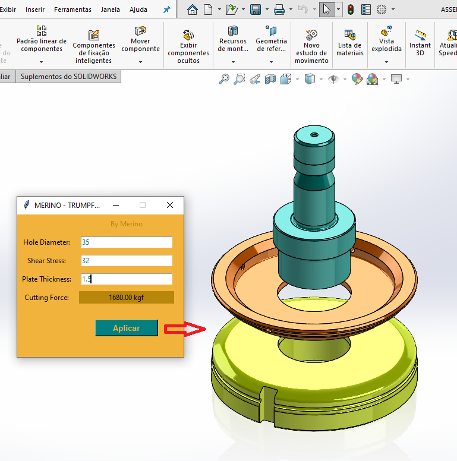
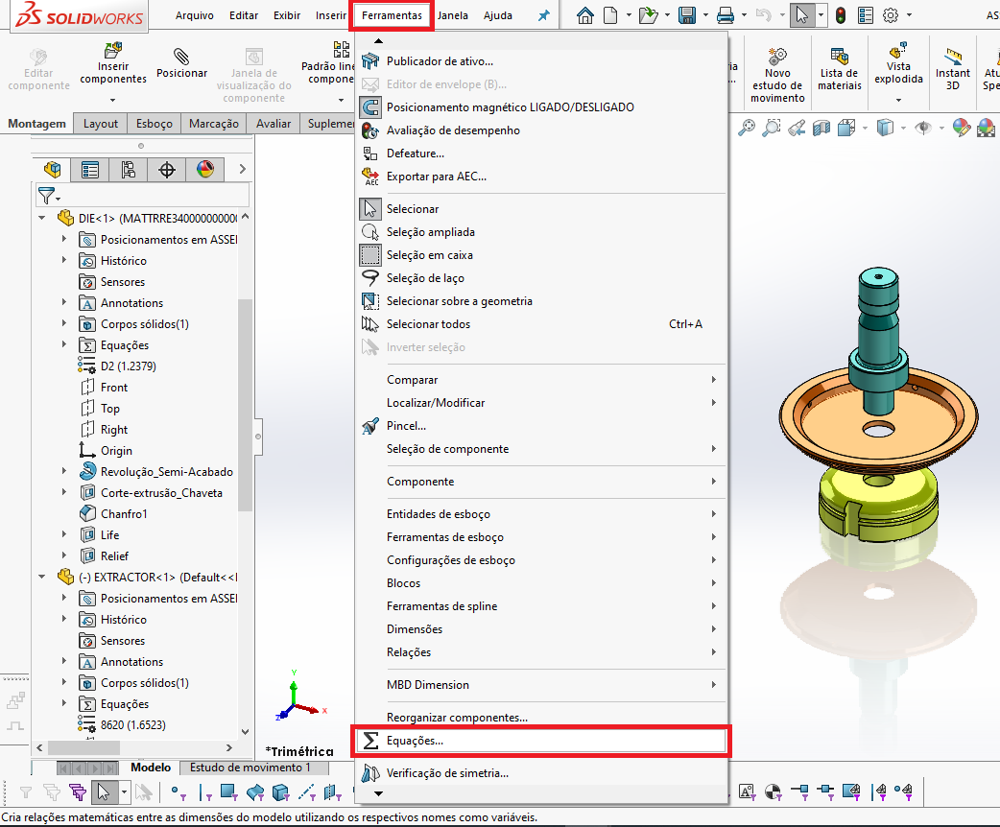
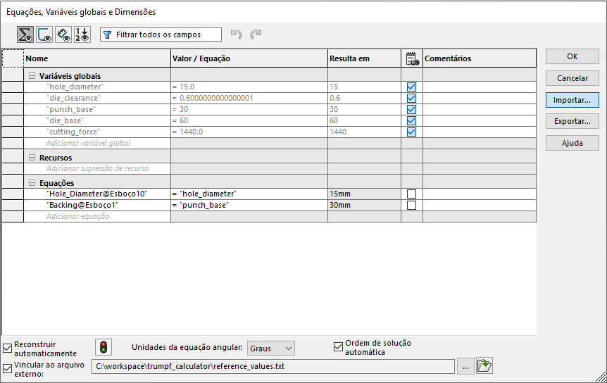
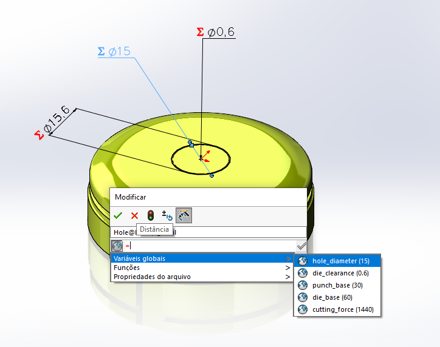
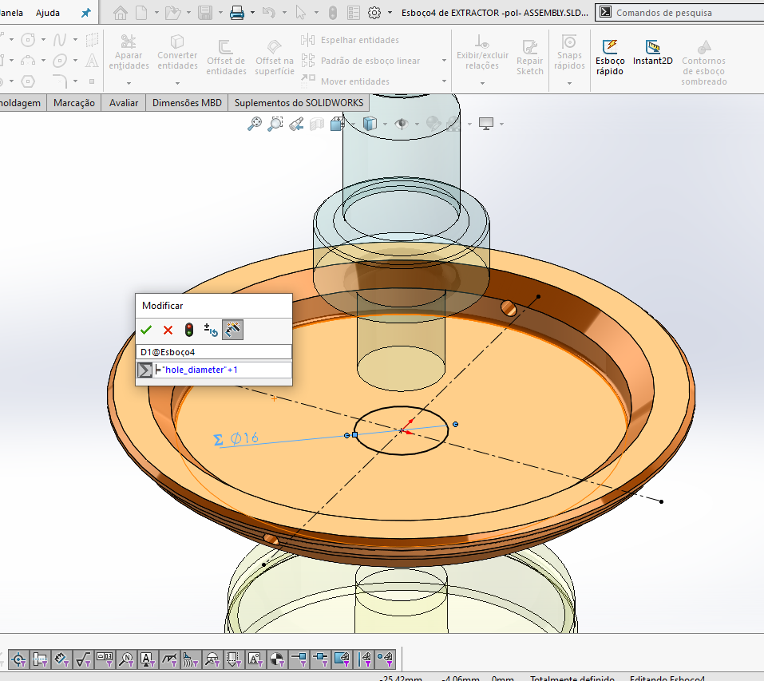

<h1 align="center">
    
</h1><br>

This is a simple demonstration to integrate Python with SolidWorks and improve efficiency in 3D modeling and projects.
<br>


## The Python and the SolidWorks:

The SolidWorks is a popular CAD software that is widely used in the industry to design 3D parts and assemblies. Integrating Python with SolidWorks can allow for the automation of repetitive tasks, running simulations and data analysis, and creating custom features.
<br>

This Python script calculates some variables related to tooling design and exports them to a TXT file. These variables can be used in SolidWorks to facilitate 3D modeling.
<br>


## Installation

* Install Python 3.8 or newer.
* Download or copy the script sw_integrate.py to your computer.
* Download the 3D models, they should be located in the models folder, which in turn should be in the same directory as the sw_integrate.py script.
<br>


## GUI Interface

The script has a simple GUI interface built with Tkinter. The input fields and output labels are displayed in a window with the following dimensions:
<br>
* Width: 280 pixels
* Height: 240 pixels
* The GUI window is not resizable.
<br>


## Usage

* In SolidWorks, open the 3D model ASSEMBLY.SLDASM.
* Open a command prompt or terminal window.
* Navigate to the directory where sw_integrate.py is located.
* Run the script using the command python sw_integrate.py.
* Enter the required input values in the GUI window that appears.
* Click the "Aplicar" button to export the variables to a TXT file.
* The output file will be named reference_values.txt and will be located in the same directory as the script.
* Update the model in SolidWorks.
<br>
<div align="center">
    
</div>
<br>


## Input Variables

* Hole Diameter: The diameter of the hole in the tooling (in millimeters).
* Shear Stress: The shear stress of the material being punched (in MPa).
* Plate Thickness: The thickness of the plate being punched (in millimeters).
<br>


## Output Variables

The following variables are calculated by the script and exported to the output file:
<br>
* hole_diameter: The hole diameter value entered by the user (in millimeters).
* die_clearance: The clearance between the punch and die (in millimeters).
* punch_base: The diameter of the punch base (in millimeters).
* die_base: The diameter of the die base (in millimeters).
* cutting_force: The cutting force required to punch the hole (in kilograms-force).
<br>


## Applying to custom projects:

* Your code should generate the variables in a txt file, in the format below.

```
    "var_name" = value
    "hole_diameter" = 3.0
    "die_clearance" = 4.8
    "punch_base" = 30
    "die_base" = 60
```
<br>

* For this, we can use the with open function, as exemplified in the sw_integration script.

```Python
    ...
        with open(f'{file_name}.txt', 'w') as file:
            file.writelines(f'"hole_diameter" = {hole_diameter()}\n')
            file.writelines(f'"die_clearance" = {die_clearance()}\n')
            file.writelines(f'"punch_base" = {punch_base()}\n')
            file.writelines(f'"die_base" = {die_base()}\n')
    ...
```

* In SolidWOrks, from the menu bar, go to Tools > Equations. A dialog box will appear. Import your txt file there.
<div style="display: flex;" align="center">
    
    
</div>
<br>

* To link a global variable to a feature, simply type the global variable name in the cell next to the dimension or parameter that you want to link it to.
<div align="center">
    
</div>
<br>

* You can now edit the equations to add any necessary mathematical operations or use the global variables in other parts of the model.
<div align="center">
    
</div>
<br>

* Once you have linked all the global variables, save the design table and close it.
<br>

## License
This script is licensed under the MIT License.
<br>

## Contact
For any questions or comments, please contact the author.